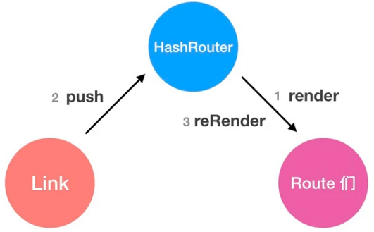

# 项目关键点说明
## 项目基本搭建
1.在命令行中输入命令：`create-react-app react-cloud-music-2021`

2.默认样式及字体图标准备：`npm install styled-components --save`

添加`styled-components`之后就可以访问全局的`window.styled`变量

```js
// 创建一个组件Top,它将渲染一个附加了样式的 <div> 标签
export const Top = styled.div`
    // ……
`;
```

3.GlobalStyle
```js
import { createGlobalStyle } from 'styled-components';
export const GlobalStyle = createGlobalStyle`
    // ……
`
```
这里的`createGlobalStyle`是一个API，用于创建全局样式，里面包裹的就是全局的Style

最终导入到`App.js`中，这个组件是最终组装所有组件的组件，最终将App组件引入到index.js中进行渲染。

另一个地方是使用`iconfont.js`，全局引入字体。

4.路由配置：`npm install react-router react-router-dom react-router-config --save`

+ react-router：React Router核心

+ react-router-dom：用于DOM绑定的React Router

+ react-router-config：静态路由配置的小助手

一些标签说明：

+ `<HashRouter>`：将路径映射到相应到组件上

+ `<Redirect to={"/recommend"} />`：重定向到路径"/recommend"

+ `{renderRoutes(routes)}`：将routes数组中的对象展开，变成Route标签旧式的Route标签的形式

> renderRoutes是从react-router-config依赖中获得的

+ `<NavLink>`：链接到相应组件



5.Redux

安装依赖：`npm install redux redux-thunk redux-immutable react-redux immutable --save`

添加store文件夹，下面添加index.js和reducer.js文件

## 推荐模块

### 轮播表

1.要安装插件：`npm install swiper --save`

由于版本的更新，这个插件引入需要修改，如下：

```js
import Swiper from 'swiper';
import "swiper/swiper-bundle.css";
```

2.Recommend组件中创建的bannerList是一个容量为4的数组，每个元素都是对象，对象里面存放`imageUrl`

recommendList是一个容量为10的数组，每个元素都是对象，对象里面存放`id、picUrl、playCount、name`四个字段

然后将这两个数组分别传入到Slider组件和RecommendList组件

3.在Slider组件中使用钩子useState创建内部state，bannerList接收props
```js
const { bannerList } = props;
```
这是一种写法，因为props可能是多个参数，bannerList是取第一个。

4.useEffect的解读
```js
useEffect(() => {
    if (bannerList.length && !sliderSwiper) {
        let newSliderSwiper = new Swiper('.slider-container', {
            loop: true,
            autoplay: {
                delay: 2000,
                disableOnInteraction: false
            },
            pagination: {
                el: '.swiper-pagination'
            }
        });
        setSliderSwiper(newSliderSwiper);
    }
}, [bannerList.length, sliderSwiper])
```
当bannerList的长度或sliderSwiper发生改变时，触发这个回调函数，这个函数作用是创建一个轮播表对象并赋值给sliderSwiper这个变量上。

 5.轮播图的使用
 ```jsx
<div className="swiper-wrapper">
    {
        bannerList.map((slider) => {
            return (
                <div className="swiper-slide" key={slider.imageUrl}>
                    <div className="slider-nav">
                        
                    </div>
                </div>
            )
        })
    }
</div>
```
使用一个map函数进行遍历展示，使用得到的bannerList对象数组

### 轮播列表
1.props接收传过来的对象数组recommendList

2.getCount函数是定义的工具函数，在api/utils.js下

3.ListItem

样式结构如下：
```js
export const ListItem = styled.div`
   ……
  .img_wrapper {
    .decorate {
    }
    ……
    .play_count {
      ……
      .play {
        ……
      }
    }
    img {
      ……
    }
  }
  .desc {
      ……
    }
`;
```
对应HTML结构如下：
```html
<div>
    <div class="img_wrapper">
        <div class="decorate"></div>
        
        <div class="play_count">
            <i class="play"></i>
        </div>
    </div>
    <div class="desc"></div>
</div>
```
### Scroll
1.安装 better-scroll：`npm install better-scroll@next --save`

官方文档：[链接](https://better-scroll.github.io/docs/zh-CN/)

2.防抖函数，定义在utils.js中
```js
/**
 * 防抖函数
 * 短时间内多次触发同一事件，只执行最后一次，或者只执行最开始的一次，中间的不执行。
 * @param {function} func 传入的函数
 * @param {number} delay 延时
 * @returns 
 */
const debounce = (func, delay) => {
    let timer;
    return function (...args) {
        if (timer) {
            clearTimeout(timer);
        }
        timer = setTimeout(() => {
            func.apply(this, args);
            clearTimeout(timer);
        }, delay);
    };
};
export { debounce };
```
3.Scroll组件的类型验证propTypes，是种比较安全的方式。defaultProps设置了传入参数的默认值

> 这两项要由于作用域问题需要放在整个文件的最下方

4.scroll 组件在业务中会被经常取到原生 DOM 对象，而函数式组件天生不具备被上层组件直接调用 ref 的条件，因此需要用 React 当中一些特殊的方式来处理，即使用 forwardRef 进行包裹。

5.`useImperativeHandle`的使用

正常情况下ref是不能挂在到函数组件上的，因为函数组件没有实例，但是useImperativeHandle为我们提供了一个类似实例的东西。它帮助我们通过useImperativeHandle的第2个参数，所返回的对象的内容挂载到父组件的ref.current上。

### axios
1.安装依赖：`npm install axios --save`

2.src/api目录下新建`config.js`文件，里面编写axios的配置：
```js
import axios from "axios";
export const baseUrl = 'http://localhost:4000';
const axiosInstance = axios.create({
    baseURL:baseUrl
});
axiosInstance.interceptors.response.use(
    res=>res.data,
    err=>{
        console.log(err,"网络错误");
    }
);
export {axiosInstance};
```
3.在`request.js`中封装不同的网络请求
```js
// 封装不同的网络请求
import {axiosInstance} from './config';
export const getBannerRequest = ()=>{
    return axiosInstance.get('/banner');
}
export const getRecommendListRequest = ()=>{
    return axiosInstance.get('/personalized')
}
```
### redux层开发
1.在 Recommend 目录下，新建store文件夹，然后新建以下文件
```bash
actionCreators.js   // 放不同 action 的地方
constants.js        // 常量集合，存放不同 action 的 type 值
index.js            // 用来导出 reducer，action
reducer.js          // 存放 initialState 和 reducer 函数
```

2.需要将recommend下的reducer注册到全局store，在store/reducer.js中
```js
// reducer.js
import { combineReducers } from 'redux-immutable';
// 将recommend下的reducer注册到全局store
import { reducer as recommendReducer } from '../application/Recommend/store/index';
export default combineReducers({
    // 之后开发具体功能模块的时候添加 reducer
    recommend: recommendReducer,
});
```
### 懒加载
1.安装依赖`npm install react-lazyload --save`

2.使用
```js
// 引入 forceCheck 方法
import { forceCheck } from 'react-lazyload';

//scroll 组件中应用这个方法
<Scroll className="list" onScroll={forceCheck}>
```

3.进场效果Loading，Ajax请求往往需要一定的时间，进场效果是在数据还没有加载好的情况下显示的

这个动画效果如何实现的现在暂且搁置，总之就是在Recommend中引入这个组件

4.由于数据是异步获取，异步逻辑全在redux-thunk中执行，且 loading和数据之间是一个联动的关系，因此loading的状态应放在redux管理。


